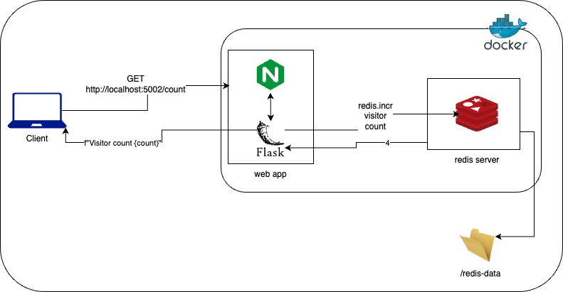

# Python Flask Redis Multicontainer App

The repository contains a multi-container application that consists of a simple Python Flask web application and a Redis database. The Flask application uses Redis to store and retrieve data. This setup is managed using Docker Compose.

## Table of Contents

- [Project Overview](#project-overview)
- [Architecture](#architecture)
- [Setup Instructions](#setup-instructions)
- [Docker Configuration](#docker-configuration)

## Project Overview

The goal of this project is to create a multi-container application with the following features:

- **Flask Web Application**:
  - GET `/`: Displays a welcome message.
  - GET `/count`: Increments and displays a visit count stored in Redis.
- **Redis Database**: Used as a key-value store to keep track of the visit count.
- **Dockerised Services**: Both Flask and Redis services are containerised.
- **Docker Compose**: Used to manage the multi-container application.
- **Persistent Storage for Redis**: Configured to use a volume to persist its data.
- **Environment Variables**: Flask application reads Redis connection details from environment variables.
- **Scaling**: The Flask service can be scaled to run multiple instances with load balancing.
- **Nginx as Reverse Proxy and Load Balancer**: Nginx is used to route requests to the Flask instances, providing load balancing and acting as a reverse proxy.

## Architecture

  


**Python** is chosen for this project due to its simplicity, readability, and extensive support for various libraries and frameworks.

**Flask** is a lightweight and flexible web framework for Python that allows developers to create web applications quickly.

**Docker** is used for containerisation, which packages the application and its dependencies into a consistent and isolated environment. This ensures that the application runs the same way regardless of where it is deployed.

**Redis** is an in-memory data structure store that is used as a database, cache, and message broker. It is chosen for this project to handle the page view count due to its high performance, scalability, and ease of use.



### Application Endpoints

Welcome Page: `http://localhost/5002`


Visitor Count: `http://localhost/5002/count`


## Setup Instructions

### Prerequisites

- Docker / Docker Desktop
- Docker Compose

### Clone the Repository

```bash
git clone https://github.com/sohailsajid79/python-flask-redis-multicontainer-app.git
cd python-flask-redis-multicontainer-app
```

### Directory Structure

python-flask-redis-multicontainer-app/<br>
├── app.py<br>
├── requirements.txt<br>
├── Dockerfile<br>
├── docker-compose.yml<br>
└── nginx.conf

## Docker Configuration

### Dockerfile

```bash
FROM python:3.11 # base image for docker container

WORKDIR /app # set working directory inside of container

COPY requirements.txt requirements.txt # copy requirements file from local machine to conatiner's working directory

RUN pip install -r requirements.txt # install dependencies inside container

COPY . . # copy application code to the container directory

ENV FLASK_APP=app.py # set env variable to target app.py

CMD [ "flask", "run", "--host=0.0.0.0", "--port=5000" ] # default command to run when the container starts
```

### docker-compose.yml

```bash
version: "3.8" # utilise latest version of docker compose
services:

  redis:
    image: "redis:alpine" # lightweight version of redis image
    ports:
      - "6379:6379" # map local port: container port
    volumes:
      - redis-data:/data # mount volume to '/data' inside container

  flask:
    depends_on: # create dependency on redis service
      - redis
    deploy:
      replicas: 3 # scale the flask service to multiple instances
    build: # directory containing the dockerfile to build the image
      context: . # (root)
    ports:
      - "5000" # expose flask app on port 5000 inside the container
    environment:
      - REDIS_HOST=redis # flask app connect to the redis service using the hostname redis

  nginx: # load balancer for the flask instances
    depends_on: # create dependency on flask service
      - flask
    image: nginx:alpine # lightweight version of nginx image
    volumes:
      - ./nginx.conf:/etc/nginx/nginx.conf # mount local 'nginx.conf' file : '/etc/nginx/nginx.conf' inside the container
    ports:
      - "80:80" # map port 80 (local host): port 80 in container - nginx server to handle http requests from the host

volumes:
  redis-data: # ensure that data stored in redis persists even if the container is stopped or removed
```

### Useful Docker & Bash commands

- Check Docker is running: `docker info`
- Stop and remove containers: `docker-compose down`
- Start / restart docker service: `docker-compose up -d`
- Scale flask service using --scale: `docker-compose up --build --scale flask=3`
- Build Docker image manually: `docker build -t <image_name> .`
- Check running containers: `docker ps`
- Check port usage: `lsof -i :<port>`
- Kill process: `kill -9 <PID>`
